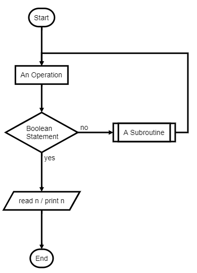

# Intro to Algorithm

Programming involves solving problems from simple to complex ones. Doing that requires a series of finite and well-defined instructions. In the context of computer science an algorithm is used to solve computational problems.

When programming, various algorithm could be discovered either through trial or literature. It is important to find the correct algorithm that suit the task. A good algorithm is not ambiguous, but concise.

## Visualization

An algorithm is not meant for oneself and be thrown away. It needs to be read clearly by the programmer and others. A means of visualizing is needed.

### Pseudocode

In a broader sense algorithm is a procedure, like a recipe or manual. When representing an algorithm using english keyword in a line by line instruction it is called a pseudocode.

An example `Cup Noodle Algorithm`:

```pseudo
REMOVE plastic_cover
POUR boiling_water
CLOSE lid

SET timer TO 300
WHILE timer MORE_THAN 0:
    PRINT "DO something_productive WHILE waiting!"
    DELAY_MS 1000
    DECREMENT timer BY 1

DRAIN water
EAT
```

### Flowchart


